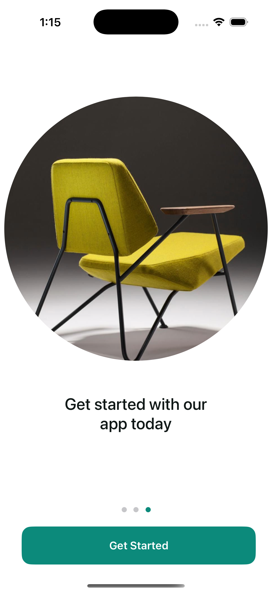
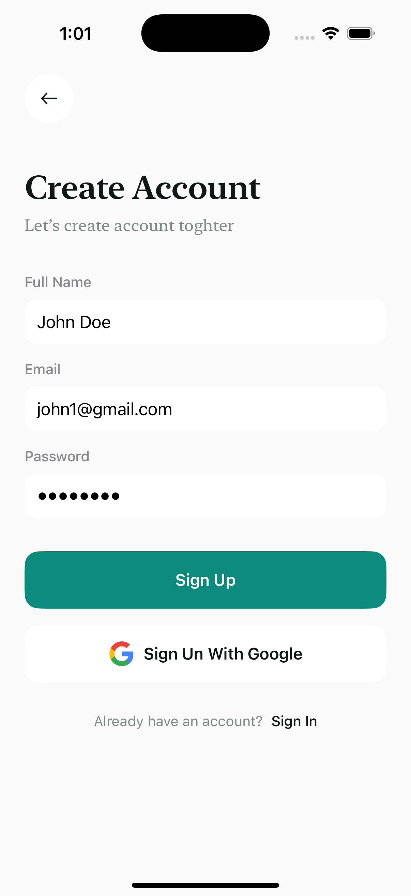
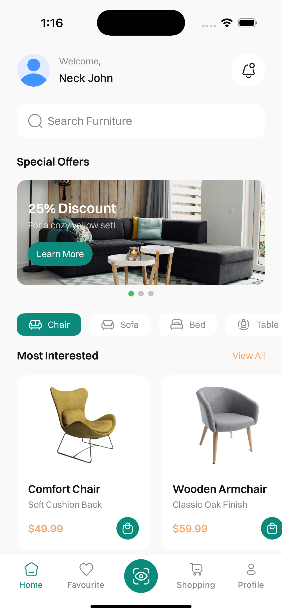
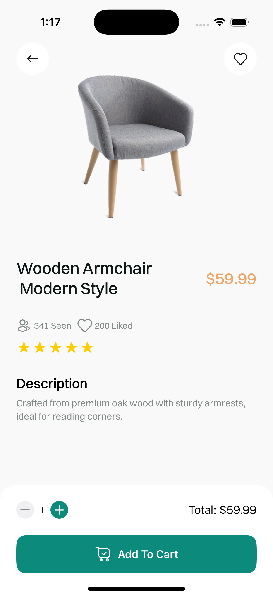
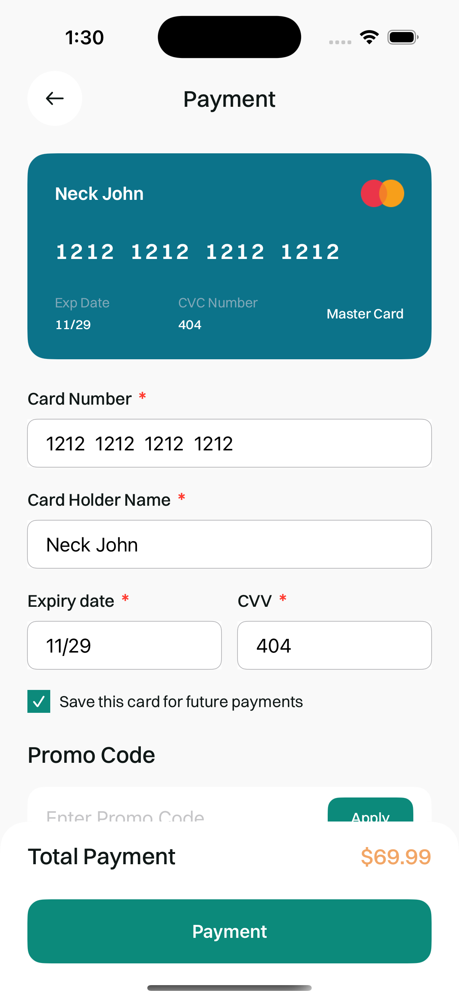
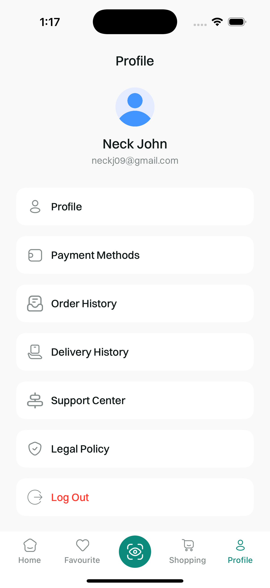

# Furniture-iOS-SwiftUI  
🛋️ *Shop your dream furniture with a smooth iOS experience, powered by SwiftUI.*  

**Furniture-iOS-SwiftUI** is a modern furniture shopping application built with Swift and SwiftUI.  
It features user authentication (login/register), a custom tab bar, product browsing with search, detailed product pages, add-to-cart functionality, dummy payment flow, and Firebase integration for backend services.

---

## 📹 App Demo

  

---

## ✨ Features
- 🔐 **User Authentication** – Login & Register using Firebase Authentication  
- 🗂 **Custom Tab Bar** – Seamless navigation across sections  
- 🛒 **Product Browsing** – Browse furniture items with search functionality  
- 📄 **Product Details** – View detailed product descriptions and pricing  
- ➕ **Add to Cart** – Manage selected items with real-time updates  
- 💳 **Dummy Payment Flow** – Simulated checkout process  
- ☁️ **Firebase Integration** – Backend services for authentication and data storage  

---

## 📸 Screenshots

| Onboarding | Register | Home |
| :-----: | :------: | :---: |
|  |  |  |

| Details | Payment | Profile |
| :----: | :-----: | :-----: |
|  |  |  |

---

## 🛠 Tech Stack
- **Language:** Swift
- **Frameworks:** SwiftUI, UIKit  
- **Backend:** Firebase Authentication, Firebase Firestore  
- **Architecture:** MVVM  
- **Tools:** Xcode, Swift Package Manager  

---

## 🏗 Architecture
The project follows the **MVVM** pattern to keep UI, business logic, and data handling cleanly separated.

---

# 🚀 Getting Started

### Clone the repository

bash
https://github.com/Md-owais-07/Furniture-iOS-SwiftUI.git

### Open the project

Open the project using the latest version of **Xcode**.

### Build & Run

Run the app.

---

# 👨‍💻 Author

**Mohammad Owais**

- GitHub: https://github.com/Md-owais-07
- LinkedIn: https://www.linkedin.com/in/mdowais1/

---

# 📄 License

This project is licensed under the MIT License.

---
