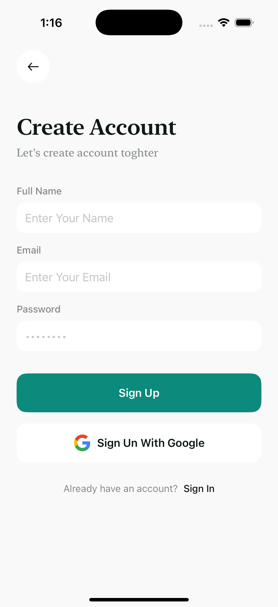

# Furniture-iOS-SwiftUI  
🛋️ *Shop your dream furniture with a smooth iOS experience, powered by SwiftUI.*  

**Furniture-iOS-SwiftUI** is a modern furniture shopping application built with Swift and SwiftUI.  
It features user authentication (login/register), a custom tab bar, product browsing with search, detailed product pages, add-to-cart functionality, dummy payment flow, and Firebase integration for backend services.

---

## 📸 Screenshots
<p align="center">
  
<!--   
   -->
</p>

---

## ✨ Features
- 🔐 **User Authentication** – Login & Register using Firebase Authentication  
- 🗂 **Custom Tab Bar** – Seamless navigation across sections  
- 🛒 **Product Browsing** – Browse furniture items with search functionality  
- 📄 **Product Details** – View detailed product descriptions and pricing  
- ➕ **Add to Cart** – Manage selected items with real-time updates  
- 💳 **Dummy Payment Flow** – Simulated checkout process  
- ☁️ **Firebase Integration** – Backend services for authentication and data storage  

---

## 🛠 Tech Stack
- **Language:** Swift 5.9  
- **Frameworks:** SwiftUI, UIKit  
- **Backend:** Firebase Authentication, Firebase Firestore  
- **Architecture:** MVVM  
- **Tools:** Xcode, Swift Package Manager  

---

## 🏗 Architecture
The project follows the **MVVM** pattern to keep UI, business logic, and data handling cleanly separated.


---

## 🚀 Installation
1. Clone the repository  
   ```bash
   git clone https://github.com/your-username/Furniture-iOS-SwiftUI.git
   cd Furniture-iOS-SwiftUI
